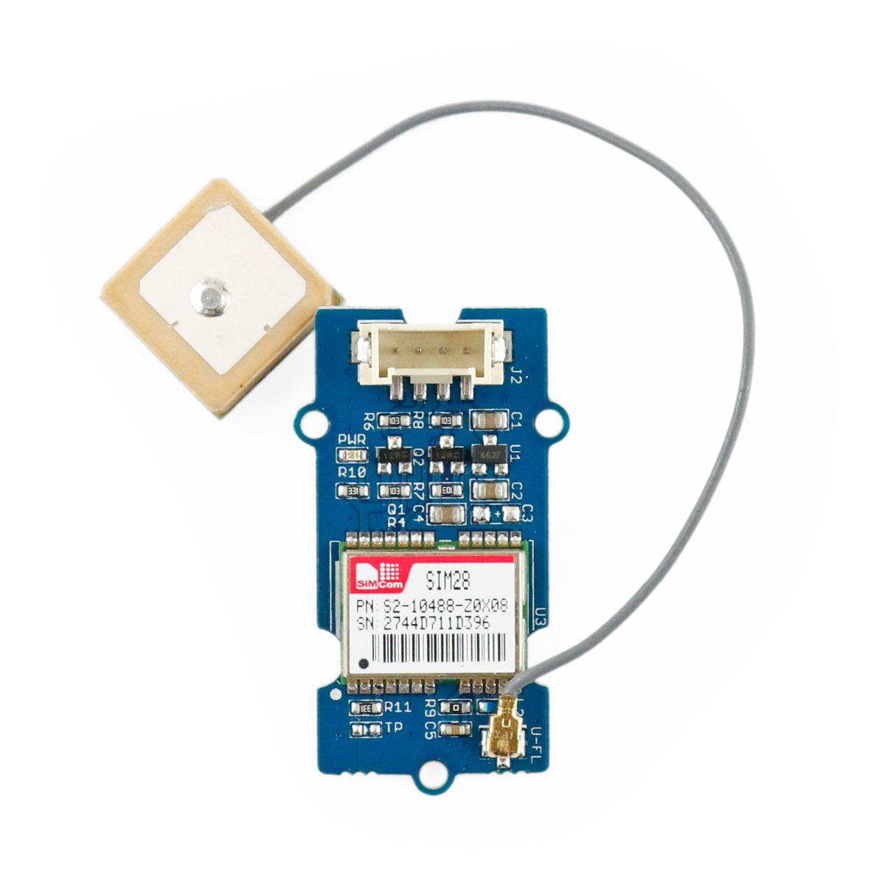

---
title: "GPS"
date: "2018-10-01T14:32:35.000Z"
tags: 
  - "sensor"
coverImage: "50_gps.jpg"
material_number: "50"
material_type: "sensor"
material_short_descr: "Seeed Studio Grove – GPS"
manufacture: "Seeed Studio"
manufacture_url: "https://www.seeedstudio.com/"
repo_name: "mks-SeeedStudio-Grove_GPS_v1.2"
repo_prefix: "mks"
repo_manufacture: "SeeedStudio"
repo_part: "Grove_GPS_v1.2"
product_url: "https://wiki.seeedstudio.com/Grove-GPS/"
clone_url: "https://github.com/Make-Your-School/mks-SeeedStudio-Grove_GPS_v1.2.git"
embedded_example_file: "examples/Grove_GPS_v1.2_minimal/Grove_GPS_v1.2_minimal.ino"
---

# GPS

## Beschreibung
Das GPS-Modul liefert seine genaue Position in Längen- und Breitengraden. Es kann dazu eingesetzt werden, um Bewegungen auf der Erde aufzuzeichnen oder auch Geotagging-Aufgaben zu bewältigen. Das Modul lässt sich direkt oder mithilfe des Grove Shields an einen Arduino oder Raspberry Pi anschließen. Es kommuniziert über \[simple\_tooltip content='Bei einer seriellen Datenübertragung werden die Bits (Informationen / Kommandos) nacheinander (seriell) über eine Leitung übertragen. Die wichtigsten seriellen Standards im Rahmen der Microcontroller sind I2C (Inter-Integrated Circuit), SPI (Serial Peripheral Interface) und UART (Universal Asynchronous Receiver Transmitter). Die genaue Funktionsweise ist für die reine Nutzung vorerst irrelevant. Es muss allerdings immer geprüft werden an welchen Pins oder an welchen Steckplätzen der jeweilige serielle Anschluss genutzt werden kann. Dies wird in den Datenblättern der Mikrocontroller normalerweise immer mit angegeben.'\]die serielle Schnittstelle I2C\[/simple\_tooltip\].

Alle weiteren Hintergrundinformationen sowie ein Beispielaufbau und alle notwendigen Programmbibliotheken sind auf dem offiziellen Wiki (bisher nur in englischer Sprache) von Seeed Studio zusammengefasst. Zusätzlich findet man über alle gängigen Suchmaschinen meist nur mit der Eingabe der genauen Komponenten-Bezeichnungen entsprechende Projektbeispiele und Tutorials.

<!-- infolist -->

<!-- infolists -->
## Wichtige Links für die ersten Schritte:

- [Seeed Studio Wiki](http://wiki.seeedstudio.com/Grove-GPS/) [- GPS](http://wiki.seeedstudio.com/Grove-GPS/)

## Weiterführende Hintergrundinformationen:

- [I2C - Wikipedia Artikel](https://de.wikipedia.org/wiki/I%C2%B2C)
- [SPI - Wikipedia Artikel](https://de.wikipedia.org/wiki/Serial_Peripheral_Interface)
- [UART - Wikipedia Artikel](https://de.wikipedia.org/wiki/Universal_Asynchronous_Receiver_Transmitter)
- [GPS - Wikipedia Artikel](https://de.wikipedia.org/wiki/Global_Positioning_System)
- [Geographise Koordinaten - Wikipedia Artikel](https://de.wikipedia.org/wiki/Geographische_Koordinaten)
- [GitHub-Repository: GPS](https://github.com/MakeYourSchool/50-GPS)

